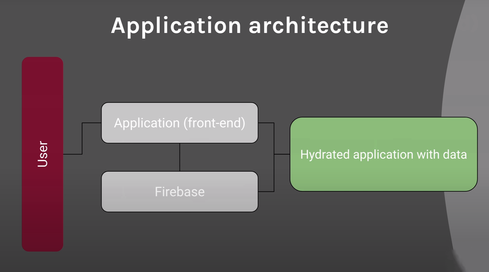
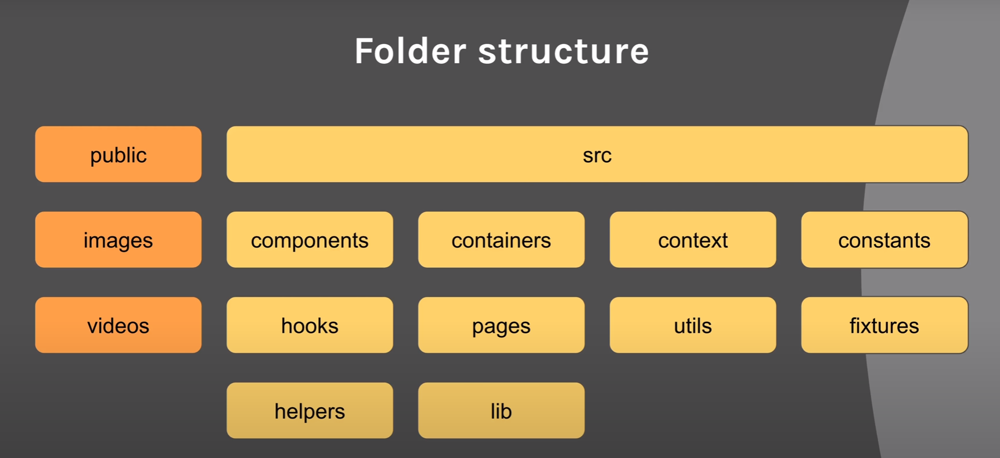
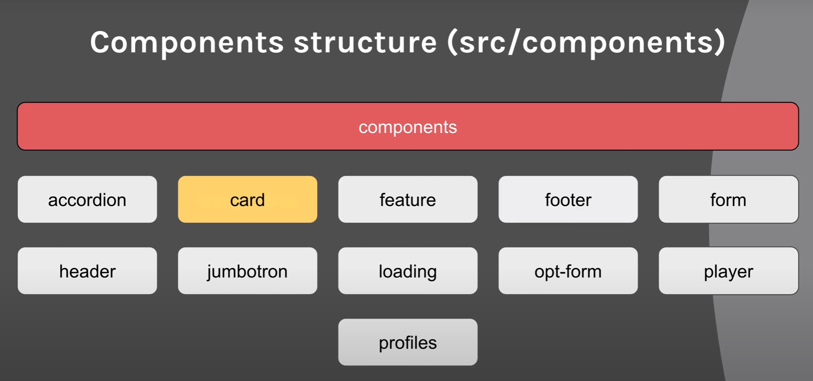
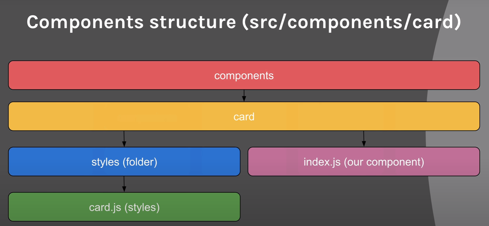

# Netflix React+Firebase App

## Technology:
- ### JavaScript  

- ### React JS 

- ### Styled Components  

- ###  Firebase 
- ### Context API 

- ###  Jest Testing 

---

### Architecture:

### Additional packages:
- firebase - backend library
- fuse.js - search library
- normalize.css - to reset default css
- react-router-dom - to setup routes
- styled-components - to manage styled components
- prettier - to format code during development

---
## ToDos

### Project configuration 
  - [x] Architecture overview
  - [x] Installation Create React App
  - [x] CRA boilerplate cleanup
  - [x] Initialization GIT
  - [x] Adding GitHub remote repository
  - [x] Creating folders for architecture structure
 ### Project work:
- [x] Creating Jumbotron component
- [x] Creating GlobalStyles styled component
- [x] Implementing Normalize.css
- [x] 	Implementing Normalize.css
- [x] 	Installing ESLint, Prettier
- [x] 	Item component
- [x] 	Item component direction prop
- [x] 	Container derivative component
- [x] 	Modules, errors
- [x] 	Footer component
- [x] 	Accordion component
- [x] 	useContext for Compound Components
- [x] 	VSCode tip for importing
- [x] 	Accordion component body
- [x] 	Accordion component review
- [x] 	Opt-form component creation
- [x] 	Opt-form component review
- [x] 	Constants - routes
- [x] 	Pages: Home, Browse, SignIn, SignUp
- [x] 	Creating React Router Routes
- [x] 	Header component
- [x] 	Template review
- [x] 	Firebase connection
- [x] 	React Context for Firebase
- [x] 	SignIn Page
- [x] 	Firebase top level authentication
- [x] 	Firebase console authentication
- [x] 	Debugging error auth (if user is in the db or not)
- [x] 	SignUp Page
- [x] 	Registration page, routes debugging
- [x] 	Navigation
- [x] 	Helpers: routes (React router auth)
- [x] 	Protect routes
- [x] 	Creating an auth listener (custom hook)
- [x] 	Tip around authentication state changing
- [x] 	Helpers routes review
- [x] 	Browse page (categories films & series) component
- [x] 	Custom hook:browse page
- [x] 	Utils directory and setup
- [X] 	Browse container
- [X] 	Profiles container
- [X] 	Profiles component
- [X] 	Loading profile component
- [X] 	Spinner review
- [X] 	Header profile
- [X] 	Header profile: dropdown, chevron
- [x] 	Header search styling
- [X] 	Header play button style
- [X] 	Card list (categories, slides) - films & series logic
- [X] 	Entities logic start
- [X] 	Player component and Card component styling
- [X] 	Movie recommendations
- [X] 	Feature component (showing)
- [X] 	Passing props into our Feature (item obj)
- [X] 	More styling on the card style
- [X] 	Debugging the slides
- [X] 	Debugging play button and card
- [X] 	Player component
- [X] 	Review player video
- [X] 	Live search using Fuse.js
- [X] 	Review our project!
- [ ]   ### Testing:
- [X] 	Testing setup
- [ ] 	Player test
- [ ] 	Footer test
- [ ] 	Accordion test
- [ ] 	Card test
- [ ] 	Feature test
- [ ] 	Form test
- [ ] 	Opt form test
- [ ] 	Player test
- [ ] 	Loading test
- [ ] 	Profile test
- [ ] 	Jumbotron test
- [ ] 	Header test
- [ ] 	Home page test
- [ ] 	Profiles test
- [ ] 	Adding test-ids to Profiles
- [ ] 	Selection filter test
- [ ] 	SignIn Test
- [ ] 	SignUp Test
- [ ] 	We are done! Review and sign off!

